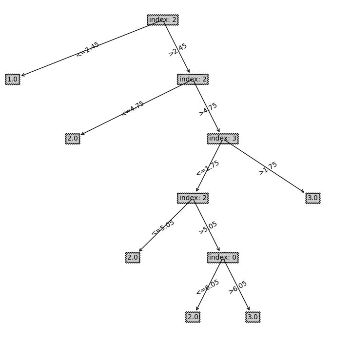

# LAB1 状态空间表示(MC 问题)

**1.状态表示**

  用一个三元组 $(M, C, B)$ 表示当前的状态, 其中 M 表示左岸传教士个数, C 表示左岸野人个数, B 表示左岸的船只数.  给定最初的数据, 和某一时刻的状态, 可以计算得到右岸的传教士, 野人及船只数. 用 $(M_0, C_0, B_0)$ 表示最初状态, 某一时刻右岸的状态:

$$
(M_0-M_i, C_0-C_i, B_0-B_i)
$$

**2.合法状态判断**

  合法状态判断的依据即: 任何一岸, 传教士的人数必须大于等于野人的数目. 即:

$$
M_i \ge C_i \ and \ M_0-M_i \ge C_0 - C_i
$$

代码:

```python
    # check if the state is valid
    # ml, cl 分别表示左岸的传教士人数和野人数
    def check(ml, cl):
        mr, cr = num_miss - ml, num_cann - cl
        return ml >= 0 and cl >= 0 and \
            mr >= 0 and cr >= 0 and \
            (ml == 0 or ml >= cl) and \
            (mr == 0 or mr >= cr)
```

代码中同时也判断了两边的人数是否大于0, 这是为了简化后面状态的转化.

**3.状态转换过程**

根据船的容量, 枚举它所有可能的装载方式, 然后用 2 中合理状态判断的方法筛选出合理的状态.

代码:

```python
def transform_func(num_miss: int, num_cann: int, boat_capacity: int):
    def check(ml, cl):
        ... #  同上check函数
    def fn(state):
        ml, cl, bl = state
        if bl == 1:
            res = [(ml-j, cl-(i-j), 0) for i in range(1, boat_capacity+1)
                   for j in range(0, i+1) if check(ml-j, cl-(i-j))]
        else:
            res = [(ml+j, cl+(i-j), 1) for i in range(1, boat_capacity+1)
                   for j in range(0, i+1) if check(ml+j, cl+(i-j))]
        return res
    return fn
```

先判断船在那一边, 然后枚举所有合理状态.

**4.搜索过程**

使用广度优先搜索的算法, 将最初状态放入队列中. 然后在队列不为空的情况下, 重复下列操作: 

1. 取队首元素, 判断是否为搜索终点; 是, 则将状态加入结果列表中.
2. 利用状态转换的算法拓展当前节点, 得到一个状态集.
3. 遍历状态集, 判断此状态是否在当前路径中出现过. 如果没有出现过, 则此状态加入队列中.

代码:

```python
def search(init_state, dest_check: callable, transform: callable):
    que = queue.Queue()
    que.put((init_state, None))
    res = []
    while not que.empty():
        front = que.get()
        if dest_check(front[0]):
            res.append(front)
        trans = transform(front[0])
        for t in trans:
            _, prev = front
            while prev != None and prev[0] != t:
                _, prev = prev
            if prev == None:
                que.put((t, front))
    return res
```

这个实现可以得到所有的解.

# LAB2 A* 搜索(八数码问题)

**1.状态表示**

为了便于编码, 我将状态表示为如下形式:
$$
((2, 2),
(1, 2, 3,
 4, 5, 6,
 7, 8, 0))
$$

一个元组中包含连个子元组. 第一个元组表示空格的位置(用0表示空格), 第二个元组表示九个方格从上至下从左至右排列的内容.

对于八数码问题, 目标状态为:
$$
((1, 1),
(1,2,3,
 8,0,4,
 7,6,5)
)
$$
**2.估价函数**

$f(x)$ 表示估价函数, $g(x)$ 表示起始节点到 $x$ 的真实代价, $h(x)$ 表示 $x$ 节点到目标节点的估计代价. 
$$
f(x) = g(x) + h(x)
$$
对于 A* 算法来说, 估价代价必须满足条件: $h(x)\le h^*(x)$. 其中, $h^*(x)$ 表示 $x$ 节点到目标节点的真实代价. 这个条件可以保证用贪心的方式选择出来的路径就是正确的最优路径. $h(x)$ 越接近真实值, A* 算法就能越快找到最优路径.

在本次实验中, 我选取曼哈顿距离和八数码位置错误个数作为估计代价, 并对比两者的优劣. 

曼哈顿距离是指一个数码从当前位置到正确位置的纵向和横向距离之和. 曼哈顿估价函数为每个数码的曼哈顿距离之和, 估价函数为:
$$
h(x) = \sum_{i=0}^8{(\Delta{x_i}+\Delta{y_i})}
$$
八数码问题一个可能存在的最优的解法就是在将每个数码归位的时候不需要移动别的数码, 这个解的代价即为曼哈顿距离之和. 然而, 存在这样的最优解的情况很少, 这个估价函数是总是小于等于真正的最优解的.

代码实现:

```python
def hamilton_dist_sum(state):
    # 正确位置
    des_position = ((1, 1), (0, 0), (0, 1),
                    (0, 2), (1, 2), (2, 2),
                    (2, 1), (2, 0), (1, 0))
    _, layout = state
    def hamilton(i):
        m, n = i // 3, i % 3
        x, y = des_position[layout[i]]
        return abs(x-m)+abs(y-n)
    return sum(hamilton(i) for i in range(9))
```


错误位置估价的估价函数为:
$$
h(x)=\sum_{i=0}^8 (1 \ if \ wrong\_positon(i) \ else \ 0)
$$
代码实现:

```python
def wrong_position_cnt(state):
    right_layout = (1, 2, 3,
                    8, 0, 4,
                    7, 6, 5)
    _, layout = state
    return sum(1 for i, j in zip(layout, right_layout) if i != j)
```

**3.状态的转换**

类似与实验一, 尝试将空格与不是空格的位置交换位置, 得到所有合理的下一个状态.

**4.搜索过程**

搜索过程类似与广度优先, 不同的是使用一个优先队列储存状态. 首先将初始状态放入优先队列, 在队列不为空的前提下重复下列操作:

1. 取出队首状态, 判断是否为目标状态. 如果是, 则找到最优解, 退出循环.
2. 通过状态转换得到可能的下一个状态集
3. 遍历状态集, 对于每个状态, 计算该状态的估价代价. 
4. 如果该状态已经访问过, 则需要比较当前计算的 $g$, 与之前访问时的 $g$ 的大小, 如果当前的 $g$ 小, 则需要把该状态加入队列重新拓展. 如果没有访问过, 直接加入优先队列.

```python

def search(init_state, dest_check, transform, h_estimate):
    pq = queue.PriorityQueue()
    pq.put(PQEntry(init_state, 0, h_estimate(init_state), None))
    # visited {state: g}
    visited = defaultdict(lambda: math.inf)
    visited[init_state] = 0
    while not pq.empty():
        front = pq.get()
        if dest_check(front.state):
            return front
        trans = transform(front.state)
        for g_inc, s in trans:
            g = g_inc + front.g
            if g < visited[s]:
                visited[s] = g
                h = h_estimate(s)
                pq.put(PQEntry(s, g, h, front))
    # No solution found
    return None
```

## 实验结果及分析

首先测试正确性.

```bash
(1, 2, 3)    (1, 2, 3)    (1, 2, 3)    (1, 2, 3)
(7, 8, 4) => (7, 8, 4) => (0, 8, 4) => (8, 0, 4)
(6, 5, 0)    (0, 6, 5)    (7, 6, 5)    (7, 6, 5)
```

为了更好地测试, 我写了一个随机合理状态生成的脚本, 可以生成指定数目的状态. 这里生成了1000个测试数据来测试两个不同的估价函数的表现.

使用哈密顿距离估价的测试结果:

```bash
$ time python astar.py < test > res
real    0m3.196s
user    0m0.000s
sys     0m0.015s
```

使用错误位置估价的测试结果:

```bash
$ time python astar.py wrong < test > res
real    0m24.341s
user    0m0.000s
sys     0m0.015s
```

结论: 在测试数据足够大的情况下, 哈密顿距离估价明显快于错误位置估价.

# LAB3 BP 神经网路

**1.BP**

定义误差为 $\delta_j^L \equiv \frac{\partial C}{\partial Z_j^L} $, 其中 $C = \frac{1}{2n}\sum_{i}^n|y_i-\sigma(Z_i^L)|^2$, $\sigma$ 为激活函数.

选择激活函数为 $\sigma(x) = \frac{1}{1+e^{-x}}$, 可以通过计算得到下列等式:
$$
\delta^L_j = \frac{\partial C}{\partial a^L_j}\sigma^{'}(Z^L_j)
$$

$$
\delta^L = ((\omega^{L+1})^T\cdot\delta^{l+1})\odot \sigma^{'}(Z^L)
$$

$$
\frac{\partial C}{\partial b^L_j} = \delta^L_j
$$

$$
\frac{\partial C}{\partial \omega ^L_{jk}} = \delta^L_j a^{L-1}_k
$$
利用上述四个公式可以得到 BP 的代码实现:

```python
def backprop(self, mini_batch, eta):
    # mini_batch 为训练批次, eta为学习率
    b_delta = [np.zeros(b.shape) for b in self.biases]
    w_delta = [np.zeros(w.shape) for w in self.weights]
    for x, y in mini_batch:
        zs = []  # z[l] = w[l]*a[l-1]+b[l]
        activations = [x]  # a[l] = sigmoid(z[l])
        a = x
        for b, w in zip(self.biases, self.weights):
            zs.append(np.dot(w, a)+b)
            a = sigmoid(zs[-1])
            activations.append(a)
        # backward pass
        delta = (activations[-1]-y)*sigmoid_derivative(zs[-1])
        b_delta[-1] += delta
        w_delta[-1] += np.dot(delta, activations[-2].transpose())
        for i in range(len(self.weights)-2, -1, -1):
            delta = np.dot(self.weights[i+1].transpose(),
                           delta)*sigmoid_derivative(zs[i])
            b_delta[i] += delta
            w_delta[i] += np.dot(delta, activations[i].transpose())
    self.biases = [b-eta*bd/len(mini_batch)
                   for b, bd in zip(self.biases, b_delta)]
    self.weights = [w-eta*wd/len(mini_batch)
                    for w, wd in zip(self.weights, w_delta)]
```

在上述实现中, 并不对每个训练数据更新 `weights` 和 `biases`, 而是算出对于一小批数据的 `b_delta` 和 `w_delta`, 求它们的平均值, 以此平均值去更新 `weights` 和 `biases`. 这样做可以避免特殊的数据对于训练效果的影响.

**2.激活函数**

使用$\sigma(x) = \frac{1}{1+e^{-x}}$ 作为激活函数.

```python
def sigmoid(x):
    return 1.0/(1.0+np.exp(-x))


def sigmoid_derivative(x):
    return sigmoid(x)*(1.0-sigmoid(x))
```

**3.梯度下降**

使用随意梯队下降, 每次随机选取一小批训练集, 根据这一批的平均误差更新神经网络.

```python
def gradient_desent(self, data, mini_batch_size, eta, epoches):
    '''stochastic gradient descent'''
    for _ in range(epoches):
        random.shuffle(data)
        mini_batchs = [data[i:i+mini_batch_size]
                       for i in range(0, len(data), mini_batch_size)]
        for mini_batch in mini_batchs:
            self.backprop(mini_batch, eta)
```

**4.求值**

```python
def evaluate(self, a):
    for b, w in zip(self.biases, self.weights):
        a = sigmoid(np.dot(w, a)+b)
    return a
```

## 实验结果及分析

独立运行 10 次，列出 10 次的准确率，并输出平均准确率和标准差.

测试结果:

```
$ python network.py 
accuracy: 0.9733333333333334
accuracy: 0.84
accuracy: 0.96
accuracy: 0.92
accuracy: 0.9466666666666667
accuracy: 0.9466666666666667
accuracy: 0.9466666666666667
accuracy: 0.9866666666666667
accuracy: 0.9466666666666667
accuracy: 0.9733333333333334
average: 0.944, standard deviation: 0.03900997023554079
```

# LAB4 ID3 决策树

**1.连续值的处理**

基本的 ID3 算法针对离散的数据, 对于连续值, 可以将训练集按照某个属性排序, 然后相邻两个训练数据的中间值作为分裂点. 通过就算熵, 可以得到每个属性的最佳分裂点.

得到某个属性的最佳分裂点的实现:

```python
def get_best_split(xs, ys):
    '''return the entropy and the best splitting point'''
    if len(xs) == 0:
        return float('+inf'), 0
    data = list(zip(xs, ys))
    data.sort()
    split_points = set((data[i][0]+data[i+1][0])/2 for i in range(len(xs)-1))
    entropies = [(compute_entropy(data, spl), spl)
                 for spl in split_points]
    return min(entropies)
```


**2.信息熵的计算**

熵的定义：
$$
H(D) = -\sum_{i=1}^{m}p_i log_2 p_i
$$
假设按照某个属性划分数据集, 得到 ${D_1, ..., D_n}$, 选择此属性的条件熵为:
$$
H_A(D) = \sum_{i=0}^n \frac{|D_i|}{|D|} log_2(H(D_i))
$$
代码实现:

```python
def compute_entropy(data, split_point):
    left_cnt = defaultdict(lambda: 0)
    right_cnt = defaultdict(lambda: 0)
    num_left = 0
    num_right = 0
    for x, y in data:
        if x < split_point:
            left_cnt[y] += 1
            num_left += 1
        else:
            right_cnt[y] += 1
            num_right += 1
    log = math.log2
    return (
        sum(-v/num_left*log(v/num_left)
            for v in left_cnt.values()) * num_left +
        sum(-v/num_right*log(v/num_right)
            for v in right_cnt.values()) * num_right
    ) / len(data)
```

**3.分裂**

对每个属性, 计算其最佳分裂点及其条件熵. 选择条件熵最小的属性, 根据其分裂点将训练集分割成为两部分.

```python
def split_data(data_set, labels):
    entropies = [get_best_split(xs, labels) for xs in data_set]
    min_entropy = entropies[0]
    for e in entropies:
        if e[0] < min_entropy[0]:
            min_entropy = e
    idx = entropies.index(min_entropy)
    split_point = min_entropy[1]
    left_idxs = np.where(data_set[idx] < split_point)[0]
    right_idxs = np.where(data_set[idx] >= split_point)[0]
    left = data_set[..., left_idxs]
    left_labels = labels[left_idxs]
    right_labels = labels[right_idxs]
    right = data_set[..., right_idxs]
    return idx, split_point, (left, left_labels), (right, right_labels)
```

**4.建树**

建树的终止条件为: 在训练集中只剩下一个类或者树的高度达到限制. 

```python
def create_tree(data_set, labels, max_height):
    if len(set(labels)) == 1:
        # return if there is only one label left
        return (labels[0], None, None)
    if max_height == 1:
        # reach the max height
        cnt = Counter(labels)
        return (cnt.most_common()[0][0], None, None)
    idx, split_point, left, right = split_data(data_set, labels)
    return (idx, split_point), create_tree(*left, max_height-1),\
        create_tree(*right, max_height-1)
```

## 实验结果及分析

输入训练集和测试集, 得到结果:



决策树的准确度为: 0.96.
